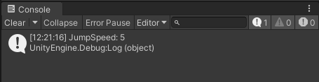

# Profiling Assignment

## Tehtävänanto

Lataa paketti, ja selvitä:
1. Mikä aiheuttaa pelin suorituskyky ongelmat? Kerro vapaasti, Kuvakin käy. Käytä Profiler työkalua hyväksi
2. Controller Scriptissä toteutetaan Jump (Hyppy). Debuggaa hyppy, ja selvitä mikä on JumpSpeed muuttujan arvo debuggauksen avulla (controller.cs, rivi 144). Liitä kuva

## Ratkaisut

### 1. Mikä aiheuttaa pelin suorituskyky ongelmat?

Profilerin mukaan suurin osa yksittäisen framen ajasta kuluu `Controller.Update` -metodissa. Methodi vaikuttaisi myös allokoivan paljon muistia, joten se on todennäköisesti syy suorituskykyongelmiin.

Koodia analysoidessa huomataan, että `Controller.Update` -metodi kutsuu riveillä 240-243 syyttä Unityn tunnetusti epätehokasta `GameObject.Find` -metodia.
`GameObject.Find` -metodi etsii scenen hierarkiasta kaikki peliobjektit, joiden nimi vastaa parametrina annettua nimeä.

Tässä tapauksessa `GameObject.Find` -metodia kutsutaan jokaisessa `Controller.Update` -metodin kutsussa `5000` kertaa.

Allokaatiot johtuvat `"Ammo" + a.ToString()` -merkkijonojen luomisesta, joita käytetään `GameObject.Find` -metodin parametrina.

Poistamalla `GameObject.Find` -metodin kutsut `Controller.Update` -metodista, saadaan pelin suorituskykyä parannettua huomattavasti.

### 2. Controller Scriptissä toteutetaan Jump (Hyppy). Debuggaa hyppy, ja selvitä mikä on JumpSpeed muuttujan arvo debuggauksen avulla.

`JumpSpeed` on `5.0f`.

## Lähteet

- https://docs.unity3d.com/ScriptReference/GameObject.Find.html