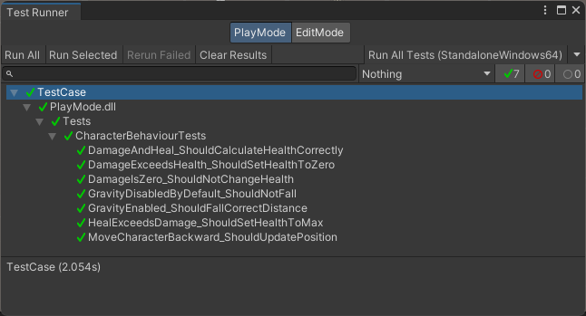
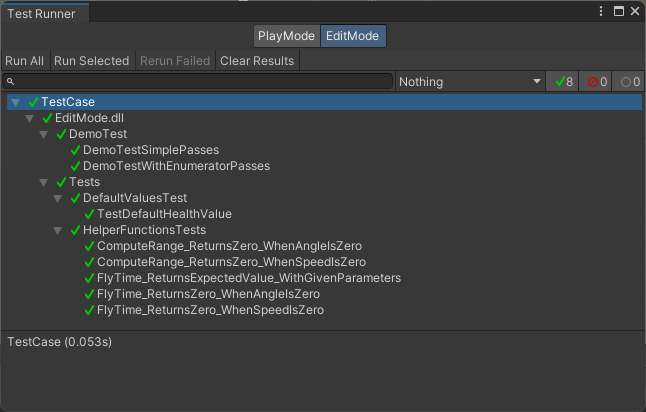

# Testing Assignment

## Tehtävänanto

Lataa zip paketti, Avaa projekti Unityllä.

Toteuta automaattiset testit.

Tarvittavat testit/tehtävät on kuvattu seuraavissa tiedostoissa. Sinun tarvitsee tehdä muutoksia ainoastaan tester tiedostoihin:
- HelperFunctionsTests.cs
- CharacterBehaviourTests.cs

## Ratkaisut

### CharacterBehaviourTests (Play mode tests)



Lisätään seuraavat testit:
```csharp
// 1. Pelaajalle tehdään 200f damage, health:in tulisi olla 0f
[UnityTest]
public IEnumerator DamageExceedsHealth_ShouldSetHealthToZero()
{
    GameObject gObject = new();
    CharacterBehaviour characterBehaviour = gObject.AddComponent<CharacterBehaviour>();
    characterBehaviour.DoDamage(200f);

    Assert.AreEqual(0f, characterBehaviour.Health);

    yield return null;
}


// 2. Pelaajalle tehdään 0f damage, health:in tulisi olla 100f;
[UnityTest]
public IEnumerator DamageIsZero_ShouldNotChangeHealth()
{
    GameObject gObject = new();
    CharacterBehaviour characterBehaviour = gObject.AddComponent<CharacterBehaviour>();
    characterBehaviour.DoDamage(0f);

    Assert.AreEqual(100f, characterBehaviour.Health);

    yield return null;
}


// 3. Pelaajalle tehdään Damagea 60f, jonka jälkeen Pelaajaa parannetaan (heal) 50f,
//    pelaajan healthin tulisi olla 90f
[UnityTest]
public IEnumerator DamageAndHeal_ShouldCalculateHealthCorrectly()
{
    GameObject gObject = new();
    CharacterBehaviour characterBehaviour = gObject.AddComponent<CharacterBehaviour>();
    characterBehaviour.DoDamage(60f);
    characterBehaviour.Heal(50f);

    Assert.AreEqual(90f, characterBehaviour.Health);

    yield return null;
}


// 4. Pelaajaa parannetaan (heal) 50f, pelaajan healtin tulisi olla 100f
[UnityTest]
public IEnumerator HealExceedsDamage_ShouldSetHealthToMax()
{
    GameObject gObject = new();
    CharacterBehaviour characterBehaviour = gObject.AddComponent<CharacterBehaviour>();
    characterBehaviour.Heal(50f);

    Assert.AreEqual(100f, characterBehaviour.Health);

    yield return null;
}


// 5. Testaa että toimiiko pelaajan liikuttaminen taaksepäin vector3(0,0,-1)
[UnityTest]
public IEnumerator MoveCharacterBackward_ShouldUpdatePosition()
{
    GameObject gObject = new();
    CharacterMoveBehaviour characterMoveBehaviour = gObject.AddComponent<CharacterMoveBehaviour>();
    characterMoveBehaviour.Move(new Vector3(0, 0, -1));

    yield return new WaitForSeconds(1f);

    Assert.AreEqual(new Vector3(0, 0, -1), characterMoveBehaviour.gameObject.transform.position);
}


// 6. Testaa jos pelaajan useGravity on asetettu true arvoon, onko pelaaja kahden sekunnin päästä
//    tippunut 19.62 yksikköä
[UnityTest]
public IEnumerator GravityEnabled_ShouldFallCorrectDistance()
{
    GameObject gObject = new();
    CharacterMoveBehaviour characterMoveBehaviour = gObject.AddComponent<CharacterMoveBehaviour>();
    characterMoveBehaviour.UseGravity = true;

    yield return new WaitForSecondsRealtime(2.0f);
    yield return null;  // It takes Unity one frame to start applying gravity

    float positionY = characterMoveBehaviour.gameObject.transform.position.y;
    Debug.Log(positionY);
    Assert.AreEqual(-19.62d, System.Math.Round(positionY, 2));
}


// 7. Testaa onko pelaajan UseGravity oletuksena pois päältä(false)
[UnityTest]
public IEnumerator GravityDisabledByDefault_ShouldNotFall()
{
    GameObject gObject = new();
    CharacterMoveBehaviour characterMoveBehaviour = gObject.AddComponent<CharacterMoveBehaviour>();

    yield return new WaitForSeconds(2.0f);

    Assert.AreEqual(0f, characterMoveBehaviour.gameObject.transform.position.y);
}
```

### HelperFunctionsTests (Edit mode tests)



Lisätään seuraavat testit:
```csharp
// 1. Testaa jos nopeus on nolla, että range on nolla
[Test]
public void ComputeRange_ReturnsZero_WhenSpeedIsZero()
{
    HelperFunctions hf = new HelperFunctions();
    float range = hf.ComputeRange(0, 25);
    Assert.AreEqual(0, range);
}

        
// 2. testaa jos kulma on nolla, että range on nolla
[Test]
public void ComputeRange_ReturnsZero_WhenAngleIsZero()
{
    HelperFunctions hf = new HelperFunctions();
    float range = hf.ComputeRange(600, 0);
    Assert.AreEqual(0, range);
}

        
// 3. testaa että heittoliikkeen lentoaika pelaa, jos nopeus on nolla
[Test]
public void FlyTime_ReturnsZero_WhenSpeedIsZero()
{
    HelperFunctions hf = new HelperFunctions();
    float time = hf.FlyTime(0, 25);
    Assert.AreEqual(0, time);
}

        
// 3. testaa että heittoliikkeen lentoaika pelaa, jos kulma on nolla
[Test]
public void FlyTime_ReturnsZero_WhenAngleIsZero()
{
    HelperFunctions hf = new HelperFunctions();
    float time = hf.FlyTime(600, 0);
    Assert.AreEqual(0, time);
}

        
// 3. testaa että heittoliikkeen lentoaika pelaa muilla arvoilla. https://fi.wikipedia.org/wiki/Heittoliike
[Test]
public void FlyTime_ReturnsExpectedValue_WithGivenParameters()
{
    HelperFunctions hf = new HelperFunctions();
    float time = hf.FlyTime(600, 25);
    Assert.AreEqual(51.70, System.Math.Round(time, 2));
}
```

## Lähteet

- [Unity Test Tools](https://docs.unity3d.com/Manual/testing-editortestsrunner.html)